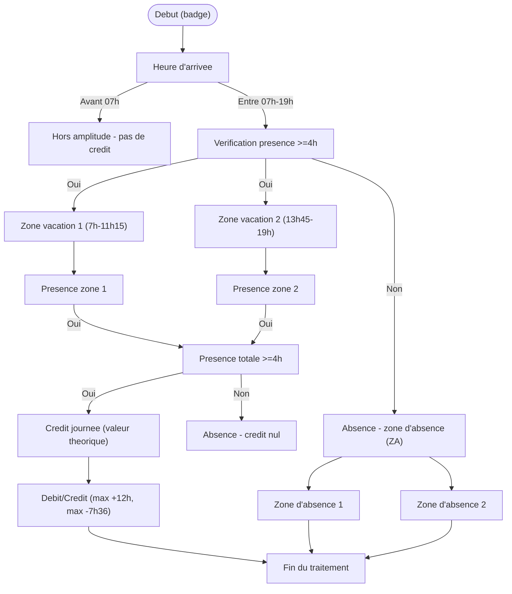

# Prométhée v3.0.4

[](https://github.com/Ktulu-Analog/promethee/releases)
[](https://www.gnu.org/licenses/agpl-3.0.html)
[](https://www.python.org/)
[](https://fastapi.tiangolo.com/)
[](https://react.dev/)
[](https://www.docker.com/)
[](https://platform.openai.com/docs/api-reference)
[](https://qdrant.tech/)

---

Prométhée est un assistant IA web auto-hébergé, pensé pour les environnements professionnels qui ne peuvent pas — ou ne veulent pas — dépendre de services cloud tiers. Il s'appuie sur n'importe quel LLM compatible OpenAI (dont [Albert](https://albert.api.etalab.gouv.fr/), l'API souveraine de la DiNum) et expose une interface React fluide avec streaming.

Ce qui le distingue : une suite d'outils directement activables par le LLM — recherche web, OCR, export bureautique (docx/pptx/xlsx/pdf), analyse de données, messagerie IMAP/SMTP, accès aux APIs juridiques Légifrance et Judilibre, intégration Grist — le tout complété par un RAG via Qdrant, une mémoire long terme vectorisée et un système de fichiers virtuel isolé par utilisateur. Le LLM peut même générer ses propres outils à la volée.

Conçu pour être déployé en production avec Docker Compose en quelques minutes.

---


---

## [3.0.4] — 2026-05-24

### Corrigé
- **`tools/legifrance_tools.py` — import `date` shadowé** : `from datetime import date` renommé en `from datetime import date as _date_today` — l'ancien import était masqué par le paramètre `date: Optional[str]` dans 5 fonctions (`legifrance_consulter_code`, `legifrance_loi_decret`, `legifrance_historique_texte`, `legifrance_code_complet`, `legifrance_code_par_ancien_id`), provoquant une `AttributeError` silencieuse dès qu'aucune date n'était fournie ; le contournement `globals()["date"].today()` présent dans le fichier était inopérant pour la même raison
- **`tools/legifrance_tools.py` — `_fmt_search` extrayait l'ID de version au lieu du Chronical ID** : `SearchTitle` expose deux champs distincts : `id` (identifiant de version, ex: `JORFARTI000...`) et `cid` (Chronical ID stable, ex: `JORFTEXT000...`) ; le code utilisait `id`, causant un `400 Bad Request` systématique lors des appels à `legifrance_jorf` en aval
- **`tools/legifrance_tools.py` — `legifrance_sommaire_jorf` passait la date en string ISO** : l'endpoint `/consult/jorfCont` attend un `ConsultDateRequest` (`{year, month, dayOfMonth}`) pour les champs `start`/`end`, pas une string `YYYY-MM-DD` — la date était ignorée ou rejetée ; ajout du paramètre `date_fin` pour permettre la recherche sur une période (ex: mois entier)
- **`tools/legifrance_tools.py` — `legifrance_jorf` retournait une coquille vide** : la fonction comptait les articles sans les afficher et renvoyait vers `legifrance_jorf_part` sans fournir les IDs de sections nécessaires, laissant le modèle sans contenu exploitable ; les articles sont désormais retournés directement (jusqu'à 50), avec fallback sur les IDs de sections pour les textes volumineux

Voir CHANGELOG.md pour les modifications antérieures.

---

## ✨ Fonctionnalités

- 💬 **Chat en streaming** avec historique chiffré (AES-GCM)
- 🧠 **Mémoire long terme (LTM)** : résumés vectorisés des conversations passées via Qdrant, avec suppression possible depuis l'interface
- 🔧 **Outils intégrés** : web, données, export (docx/pptx/pdf/xlsx), Grist, analyse de données, Python, SQL, OCR, météo, messagerie IMAP/SMTP, Légifrance, Judilibre, data.gouv.fr, génération automatique d'outils
- 🗂️ **Système de fichiers virtuel (VFS)** : le LLM travaille dans un espace de fichiers isolé par utilisateur, stocké avec Garage (S3) — aucune écriture sur le disque réel du serveur
- 📚 **RAG** (Retrieval-Augmented Generation) via Qdrant et Albert API
- 📊 **Outils collaboratifs** : intégration de l'API Grist
- 🏛️ **APIs juridiques** : Légifrance et Judilibre via PISTE
- 🔒 **Chiffrement optionnel** de la base de données SQLite
- 🎨 **Thème clair/sombre**

---

## 🚀 Installation

Deux modes d'installation sont disponibles selon l'usage :

| Mode | Cas d'usage |
|---|---|
| [🧑‍💻 Développement local (venv)](#-développement-local-avec-venv) | Modifier le code, tester, contribuer |
| [🐳 Production (Docker)](#-déploiement-en-production-avec-docker) | Déployer une instance stable multi-utilisateur |

Pour le mode Docker, `./install.sh` déroule l'installation de bout en bout et
propose au démarrage le choix entre une installation **locale** et une
installation **serveur**.

---

## 🧑‍💻 Développement local avec venv

Ce mode lance le backend Python et le frontend React séparément. Idéal pour développer et tester des modifications.

### Prérequis

- Python **3.11+** (testé avec 3.12.8)
- Node.js (pour le frontend React)
- Dépendances système selon les fonctionnalités activées (OCR, export PDF, LibreOffice…) → voir [`SYSTEM_DEPENDENCIES.md`](SYSTEM_DEPENDENCIES.md)

Installation minimale pour l'OCR :
```bash
# Ubuntu/Debian
sudo apt install tesseract-ocr tesseract-ocr-fra tesseract-ocr-eng

# macOS
brew install tesseract tesseract-lang
```

### Installation

```bash
# Cloner le dépôt
git clone https://github.com/Ktulu-Analog/promethee.git
cd promethee

# Créer et activer l'environnement virtuel
python -m venv .venv
source .venv/bin/activate  # Linux/macOS
# .venv\Scripts\activate   # Windows

# Installer les dépendances Python
pip install -r requirements.txt
```

### Configuration

```bash
cp .env.example .env
nano .env
```

Les paramètres essentiels à configurer dans `.env` :

| Variable | Description |
|---|---|
| `APP_VERSION` | Numéro de version affiché dans l'interface (ex : `3.0.0`) |
| `OPENAI_API_KEY` | Clé API (Albert, OpenAI, etc.) |
| `OPENAI_API_BASE` | URL du serveur LLM |
| `OPENAI_MODEL` | Modèle à utiliser |
| `OAUTH_CLIENT_ID` | Identifiants PISTE (Légifrance / Judilibre) |
| `QDRANT_URL` | URL Qdrant pour le RAG |
| `GRIST_API_KEY` | Clé API Grist |
| `GRIST_BASE_URL` | URL de l'instance Grist (défaut : `https://docs.getgrist.com`) |
| `IMAP_HOST` | Serveur IMAP pour la messagerie |
| `IMAP_PORT` | Port IMAP (défaut : 993) |
| `IMAP_USER` | Adresse e-mail |
| `IMAP_PASSWORD` | Mot de passe IMAP |
| `SMTP_HOST` | Serveur SMTP pour l'envoi *(optionnel)* |
| `SMTP_PORT` | Port SMTP *(optionnel)* |

### Lancement

**Backend (FastAPI) :**
```bash
python main.py
# ou directement :
uvicorn server.main:app --reload --port 8000
```

**Frontend React :**
```bash
cd frontend
npm install
npm run dev
# Interface disponible sur http://localhost:5173
```

> En développement, le frontend (port 5173) appelle directement le backend (port 8000) : l'URL de l'API est fournie par `frontend/.env.development`.  
> Pour un build de production servi par FastAPI : `npm run build` — les URL deviennent alors relatives et l'interface est servie par le backend lui-même, sur http://localhost:8000 en local.

---

## 🐳 Déploiement en production avec Docker

Ce mode déploie la pile complète (Prométhée + Qdrant + Garage S3) via Docker Compose. C'est la méthode recommandée pour une utilisation en production.

> 📖 **Guide du script d'installation** : [`documentation/guide_installation_script.md`](documentation/guide_installation_script.md)  
> Rédigé pour l'utilisateur qui installe — y compris non informaticien : ce que le script demande, ce qu'il fait, et quoi faire en cas de problème.
>
> 📖 **Procédure manuelle détaillée** : [`documentation/promethee_guide_installation.pdf`](documentation/promethee_guide_installation.pdf)  
> Architecture, dépannage et référence complète des variables d'environnement.

### Prérequis

- Un moteur de conteneurs, au choix :
  - **Docker** Engine 24.x ou supérieur + Docker Compose v2.x
  - **Podman** 4.x ou supérieur + `podman compose` (ou `podman-compose`)
  - **`container`** (moteur natif d'Apple, macOS 26+) — voir la réserve ci-dessous
- Ports libres sur l'hôte : **8000** (app), **6333/6334** (Qdrant), **3900/3901** (Garage)

> **Le moteur d'Apple n'embarque pas de compose.** La demande a été écartée en
> amont ([apple/container#239](https://github.com/apple/container/pull/239)), les
> mainteneurs renvoyant vers le mécanisme de plugins
> (`/usr/local/libexec/container/plugins`). Des plugins tiers fournissent bien
> `container compose` — par exemple
> [container-compose/compose](https://github.com/container-compose/compose) —
> et `install.sh` les détecte et les accepte.
>
> Deux réserves avant de prendre cette voie :
> - Les verbes de plugins n'apparaissent qu'une fois les services démarrés
>   (`container system start`). Tant qu'ils sont arrêtés, la CLI répond
>   « Plugins are unavailable » à **toute** sous-commande inconnue : ce message
>   ne dit donc rien de la présence réelle d'un compose.
> - Ces plugins réimplémentent la spécification Compose partiellement, or la pile
>   séquence `garage-config → garage → garage-init` via
>   `depends_on: condition: service_healthy`. Si cette condition n'est pas
>   honorée, `garage-init` démarre trop tôt et échoue. Podman et Docker restent
>   les moteurs éprouvés.

### Installation guidée — `./install.sh` (recommandé)

Le script déroule la procédure complète décrite ci-dessous : vérification des
prérequis, génération des secrets, récupération du `GARAGE_NODE_ID`, build et
vérification de la pile. Il détecte seul le moteur disponible — Docker s'il est
présent, Podman sinon — et `prom.sh` s'appuie sur la même détection.

```bash
./install.sh
```

Il commence par rappeler qu'un gestionnaire de conteneurs est indispensable —
Prométhée n'existe pas en version autonome — et demande confirmation. Si vous
répondez **non**, il vous invite à contacter votre administrateur système et
s'arrête sans rien modifier.

Il demande ensuite le mode d'installation :

| Mode | Adresse d'écoute | Usage |
|---|---|---|
| **local** | `127.0.0.1:8000` | Poste de travail personnel — rien n'est exposé sur le réseau |
| **serveur** | `0.0.0.0:8000` | Instance partagée, directement ou derrière un reverse proxy |

Le mode ne change pas l'image construite : le frontend émet des URL relatives et
suit l'origine sur laquelle il est servi. Il pilote uniquement `BIND_ADDRESS`,
`SERVER_PORT` et `ALLOWED_ORIGINS` dans `.env`.

Options principales :

```bash
./install.sh --mode local -y                                  # poste personnel, sans question
./install.sh --mode serveur --domaine https://ia.exemple.fr   # instance publique
./install.sh --reinstall                                      # repart d'un .env neuf (l'ancien est sauvegardé)
./install.sh --no-start                                       # prépare .env et le Node ID, sans démarrer
./install.sh --moteur podman                                  # impose le moteur (défaut : détection automatique)
./install.sh --help                                           # liste complète
```

Le script est **rejouable** : relancé sur une installation existante, il conserve
les secrets et la clé API déjà renseignés et ne met à jour que ce qui a changé.

> **Il n'existe pas d'installation « autonome ».** Le RAG, la mémoire long terme
> et le système de fichiers virtuel s'adossent directement à Qdrant et Garage :
> un environnement Python seul ne suffit pas à faire fonctionner l'application.
> Un gestionnaire de conteneurs est donc requis dans tous les cas.

> Les étapes ci-dessous décrivent la même procédure **à la main**, utile pour
> comprendre ce que fait le script ou pour diagnostiquer une installation.

### Étape 1 — Configurer le fichier `.env`

```bash
cp .env.example .env
```

Renseignez au minimum ces variables dans `.env` :

| Variable | Description |
|---|---|
| `PROMETHEE_SECRET_KEY` | Clé secrète JWT — générer avec `openssl rand -hex 32` |
| `GARAGE_RPC_SECRET` | Secret partagé Garage — générer avec `openssl rand -hex 32` |
| `GARAGE_ACCESS_KEY` | Identifiant clé S3 (format : `GK` + 24 hex) |
| `GARAGE_SECRET_KEY` | Secret clé S3 (64 hex) — générer avec `openssl rand -hex 32` |
| `GARAGE_NODE_ID` | Laisser vide pour l'instant (voir Étape 2) |

> Les commandes ci-dessous sont écrites pour Docker. **Sous Podman**, remplacez
> `docker compose` par `podman compose` et `docker exec` par `podman exec` —
> ou laissez `./install.sh` s'en charger, il détecte le moteur tout seul.

### Étape 2 — Récupérer le `GARAGE_NODE_ID` ⚠️

C'est l'étape critique : Garage génère un identifiant unique au premier démarrage, qu'il faut récupérer avant de lancer la pile complète.

```bash
# 1. Démarrer uniquement Garage
docker compose up -d garage

# 2. Attendre qu'il soit au statut **healthy**, puis récupérer le Node ID
docker exec promethee-garage /garage -c /etc/garage/garage.toml node id
```

La commande affiche une sortie de ce type :
```
56f7d01ee626b9672eb88de512607f13a79c53cb90b8f5d2195bd40cf6b147d6@garage:3901
```

Copiez uniquement la partie **avant le `@`** et ajoutez-la dans `.env` :
```env
GARAGE_NODE_ID=56f7d01ee626b9672eb88de512607f13a79c53cb90b8f5d2195bd40cf6b147d6
```

### Étape 3 — Lancer la pile complète

```bash
docker compose up -d --build
```

Le premier build peut prendre plusieurs minutes (compilation frontend React, installation des paquets Python, téléchargement de KaTeX et Mermaid).

Suivez les logs en temps réel :
```bash
docker compose logs -f
```

### Vérification

```bash
docker compose ps
```

✅ Résultat attendu : `promethee`, `qdrant` et `garage` affichent `Up ... (healthy)`. Les services one-shot `garage-config` et `garage-init` affichent `Exited (0)`.

L'application est accessible sur **http://localhost:8000**.

### Accès depuis un autre poste (mode serveur)

Le frontend compilé émet des URL **relatives** : il s'adresse toujours à l'origine
depuis laquelle il a été chargé. Aucune reconstruction de l'image n'est donc
nécessaire pour changer de nom de domaine — exposer le port 8000, ou placer un
reverse proxy devant, suffit.

Deux points de vigilance :

- **WebSocket** — le schéma suit automatiquement celui de la page (`wss://` sous
  HTTPS). Le reverse proxy doit relayer les en-têtes `Upgrade` et `Connection`,
  faute de quoi le flux de chat restera muet.
- **`ALLOWED_ORIGINS`** — sans objet ici : le frontend étant servi par FastAPI sur
  la même origine, CORS n'est pas déclenché. Cette variable ne sert que si vous
  servez le frontend séparément.

Dans ce dernier cas (frontend sur un domaine distinct), indiquez l'API **au moment
du build**, les variables Vite étant figées dans le bundle compilé :

```bash
VITE_API_URL=https://api.example.org VITE_WS_URL=wss://api.example.org npm run build
```

et renseignez alors `ALLOWED_ORIGINS` avec l'origine du frontend.

---

## 📁 Structure du projet

```
promethee/
├── core/                        # Moteur applicatif
│   ├── config.py                # Variables d'environnement et paramètres globaux
│   ├── database.py              # Accès SQLite (conversations, utilisateurs, VFS)
│   ├── crypto.py                # Chiffrement AES-GCM de la base de données
│   ├── llm_clients.py           # Clients LLM (Albert, OpenAI-compatible, Ollama)
│   ├── llm_service.py           # Orchestration de la boucle agent (streaming)
│   ├── llm_events.py            # Événements SSE / WebSocket
│   ├── llm_logging.py           # Journalisation des appels LLM
│   ├── context_manager.py       # Gestion et consolidation du contexte
│   ├── session_memory.py        # Mémoire de session (historique en cours)
│   ├── long_term_memory.py      # Mémoire long terme vectorisée (Qdrant)
│   ├── rag_engine.py            # Moteur RAG (ingestion + recherche Qdrant)
│   ├── ocr_engine.py            # OCR via Tesseract
│   ├── tools_engine.py          # Chargement et dispatch des outils
│   ├── skill_manager.py         # Injection dynamique des skills en contexte
│   ├── virtual_fs.py            # Système de fichiers virtuel (VFS SQLite)
│   ├── user_manager.py          # Gestion des utilisateurs et authentification
│   ├── user_config.py           # Préférences utilisateur
│   └── request_context.py       # Contexte de requête (session, user, tools)
│
├── tools/                       # Outils disponibles pour l'agent
│   ├── web_tools.py             # Navigation, scraping, DuckDuckGo / SearXNG
│   ├── export_tools.py          # Génération docx, pptx, pdf, xlsx, odt…
│   ├── export_template_tools.py # Export depuis gabarits organisationnels
│   ├── data_tools.py            # Manipulation et analyse de données
│   ├── data_file_tools.py       # Chargement et transformation CSV/Excel (pandas)
│   ├── ocr_tools.py             # OCR via Tesseract
│   ├── vfs_tools.py             # Opérations VFS (lecture, écriture, archives…)
│   ├── skill_tools.py           # Consultation dynamique des guides de compétences
│   ├── reformulation_tools.py   # Reformulation de comptes rendus oraux
│   ├── meteo_tools.py           # Météo via Open-Meteo (sans clé API)
│   ├── imap_tools.py            # Messagerie IMAP/SMTP
│   ├── grist_tools.py           # API Grist (tableurs collaboratifs)
│   ├── legifrance_tools.py      # API Légifrance (PISTE)
│   ├── judilibre_tools.py       # API Judilibre (PISTE)
│   ├── datagouv_tools.py        # API data.gouv.fr
│   └── tool_creator_tools.py    # Génération automatique d'un nouvel outil
│
├── server/                      # API FastAPI (backend)
│   ├── main.py                  # Point d'entrée uvicorn, montage des routers
│   ├── deps.py                  # Dépendances FastAPI (auth, session…)
│   ├── schemas.py               # Schémas Pydantic (requêtes / réponses)
│   ├── WS_PROTOCOL.md           # Documentation du protocole WebSocket
│   └── routers/                 # Endpoints REST + WebSocket
│       ├── ws_chat.py           # WebSocket de chat (boucle agent)
│       ├── auth.py              # Authentification (login, JWT, unlock)
│       ├── conversations.py     # CRUD conversations
│       ├── settings.py          # Paramètres utilisateur
│       ├── profiles_skills.py   # Profils et skills
│       ├── rag.py               # Endpoints RAG (recherche, collections)
│       ├── ingest_admin.py      # Ingestion de documents (RAG)
│       ├── upload.py            # Upload de fichiers vers le VFS
│       ├── vfs_router.py        # API VFS (liste, download, quota)
│       ├── tools_router.py      # Endpoints outils
│       ├── admin.py             # Administration (utilisateurs, stats)
│       └── monitoring.py        # Healthcheck et métriques
│
├── frontend/                    # Interface React (Vite + TypeScript)
│   ├── index.html
│   ├── vite.config.ts
│   ├── tsconfig.json
│   ├── package.json
│   └── src/
│       ├── App.tsx              # Composant racine, routing
│       ├── main.tsx             # Point d'entrée React
│       ├── components/
│       │   ├── chat/
│       │   │   ├── ChatPanel.tsx        # Panneau de chat principal
│       │   │   ├── ChatInput.tsx        # Zone de saisie
│       │   │   ├── MessageBubble.tsx    # Rendu d'un message
│       │   │   ├── ArtifactPanel.tsx    # Panneau artefacts (code, fichiers)
│       │   │   ├── EChartsBlock.tsx     # Rendu de graphiques ECharts
│       │   │   ├── MermaidBlock.tsx     # Rendu de diagrammes Mermaid
│       │   │   └── MetricsBar.tsx       # Barre de métriques (tokens, temps…)
│       │   ├── sidebar/
│       │   │   ├── ConvSidePanel.tsx    # Panneau latéral conversations
│       │   │   ├── ConvItem.tsx         # Item de conversation
│       │   │   ├── DiscussionsPanel.tsx # Liste des discussions
│       │   │   ├── SidebarFooter.tsx    # Pied de sidebar
│       │   │   ├── SidebarRail.tsx      # Rail de navigation
│       │   │   └── ConfirmModal.tsx     # Modale de confirmation
│       │   ├── settings/
│       │   │   ├── SettingsDialog.tsx
│       │   │   ├── TabModel.tsx         # Onglet modèle LLM
│       │   │   ├── TabApiKeys.tsx       # Onglet clés API
│       │   │   ├── TabOutils.tsx        # Onglet outils
│       │   │   └── TabsExtra.tsx        # Onglets supplémentaires
│       │   ├── admin/
│       │   │   ├── AdminPanel.tsx       # Panneau d'administration
│       │   │   └── IngestPanel.tsx      # Ingestion de documents RAG
│       │   ├── profiles/    ProfilesPanel.tsx
│       │   ├── projects/    ProjectsPanel.tsx
│       │   ├── rag/         RagPanel.tsx
│       │   ├── tools/       ToolsPanel.tsx
│       │   ├── vfs/         VfsPanel.tsx
│       │   ├── auth/        LoginScreen.tsx
│       │   └── ui/          # Composants UI génériques (ThemeSwitch, icons…)
│       ├── hooks/                       # Hooks React personnalisés
│       │   ├── useAgentStream.ts        # Streaming WebSocket agent
│       │   ├── useArtifactPanel.ts      # Gestion du panneau artefacts
│       │   ├── useConversationTree.ts   # Arbre de conversation
│       │   ├── useAuth.ts
│       │   ├── useSettings.ts
│       │   └── useSplitPane.ts
│       ├── lib/                         # Utilitaires
│       │   ├── api.ts                   # Client HTTP (fetch wrapper)
│       │   ├── markdownToHtml.ts        # Rendu Markdown → HTML
│       │   └── useTheme.ts
│       └── styles/
│           └── theme.css               # Variables CSS / thème clair-sombre
│
├── skills/                      # Guides de compétences injectés en contexte LLM
├── scripts/                     # Scripts utilitaires (à exécuter une fois)
│   ├── download_katex.py        # Télécharge les assets KaTeX dans assets/katex/
│   └── download_mermaid.py      # Télécharge Mermaid.js dans assets/mermaid/
├── documentation/               # Documentation technique
│   ├── promethee_guide_installation.pdf  # Guide d'installation Docker
│   ├── doc_developpeur_tools.pdf         # Guide développeur outils
│   └── modele_tools.py                   # Modèle de référence pour créer un outil
├── main.py                      # Point d'entrée de l'application
├── prompts.yml                  # Prompts système
├── pyproject.toml               # Métadonnées du projet Python
├── requirements.txt             # Dépendances Python
├── docker-compose.yml           # Stack Docker complète (5 services)
├── Dockerfile                   # Image Docker Prométhée (FastAPI + React)
├── Dockerfile.garage-init       # Image one-shot pour l'initialisation Garage
├── garage.toml                  # Configuration Garage (stockage S3)
├── SYSTEM_DEPENDENCIES.md       # Dépendances système requises
├── CONTRIBUTING.md              # Guide de contribution
└── .env.example                 # Modèle de configuration
```

---

## 🎨 Rendu riche : LaTeX, Mermaid et ECharts

Prométhée intègre un moteur de rendu LaTeX, Mermaid et ECharts dans le chat, fonctionnant entièrement en local grâce à des assets embarqués.

### Formules LaTeX — KaTeX

Les formules mathématiques sont rendues via **KaTeX** (assets locaux, aucune connexion requise).

| Syntaxe | Mode | Exemple |
|---|---|---|
| `$ ... $` ou `\( ... \)` | Inline (dans le texte) | `$E = mc^2$` |
| `$$ ... $$` ou `\[ ... \]` | Display (bloc centré) | `$$\int_0^\infty e^{-x}\,dx$$` |

> **Note :** les dollars monétaires (`$42`, `USD$`) sont automatiquement ignorés grâce à une heuristique anti-faux-positifs.

Pour télécharger les assets KaTeX (à exécuter une seule fois après le clonage) :
```bash
python scripts/download_katex.py
```

### Diagrammes Mermaid (version préliminaire)

Les blocs ` ```mermaid ` sont rendus en SVG via **Mermaid.js** (v11.14.0, bundle local).

Tous les types de diagrammes sont supportés : flowchart, séquence, Gantt, état, classe, entité-relation, Sankey, etc.
**Il reste des erreurs dans le moteur de rendu, notamment sur les accents. Ceci est en cours de correction pour une prochaine version**

Voici un exemple de rendu par Prométhée avec Mermaid :
*(prompt : à partir de ce rapport, génère un diagramme de flux pour présenter le système d'horaires souples)*



Pour télécharger l'asset Mermaid (à exécuter une seule fois après le clonage) :
```bash
python scripts/download_mermaid.py
```

### Graphiques interactifs — ECharts

Les blocs de données structurées sont rendus en graphiques interactifs via **Apache ECharts**, directement dans le chat. L'agent peut générer des barres, courbes, camemberts, graphiques radar, cartes de chaleur, etc., à partir de fichiers CSV, tableurs ou de données fournies dans la conversation.

Exemple de prompt déclencheur :
> *« À partir de ce fichier CSV, génère un graphique en barres empilées par service et par mois. »*

Le LLM produit une configuration ECharts JSON que le composant `EChartsBlock.tsx` interprète et rend côté client — aucun rendu serveur, aucune dépendance externe.

Types de graphiques supportés : barres, courbes, aires, camemberts, nuages de points, radar, Sankey, cartes de chaleur, et tous les types ECharts standards.

---

## 🛠️ Outils disponibles

| Outil | Description |
|---|---|
| `web_tools` | Recherche DuckDuckGo / SearXNG, scraping, capture d'écran, extraction de contenu |
| `export_tools` | Génération docx, pptx, xlsx, pdf, md, odt/odp/ods (LibreOffice) |
| `export_template_tools` | Génération docx et pptx depuis un gabarit organisationnel |
| `data_tools` | Manipulation de données, calculs sur dates/heures, expressions régulières |
| `data_file_tools` | Chargement, exploration et transformation de fichiers CSV/Excel (pandas) |
| `ocr_tools` | OCR via Tesseract (images et PDF scannés), détection automatique |
| `vfs_tools` | Système de fichiers virtuel : lecture, écriture, navigation, archives, diff (20 outils) |
| `skill_tools` | Consultation dynamique des guides de compétences injectés en contexte |
| `reformulation_tools` | Reformulation de transcriptions orales (.docx) dans un style écrit |
| `meteo_tools` | Météo actuelle et prévisions 7 jours via Open-Meteo (sans clé API) |
| `imap_tools` | Lecture, recherche, envoi et gestion d'e-mails via IMAP/SMTP |
| `tool_creator_tools` | Génération automatique d'un nouvel outil Prométhée par le LLM |
| `grist_tools` | API Grist : lecture et écriture dans des tableurs collaboratifs |
| `legifrance_tools` | API Légifrance (PISTE) : recherche et consultation de textes juridiques |
| `judilibre_tools` | API Judilibre (PISTE) : recherche de décisions de justice |
| `datagouv_tools` | API data.gouv.fr : recherche et téléchargement de jeux de données ouverts |

---

## 🛠️ Scripts utilitaires

| Script | Description |
|---|---|
| `install.sh` | Installation guidée de la pile Docker, au choix en mode local ou serveur. Voir [Déploiement Docker](#-déploiement-en-production-avec-docker). |
| `prom.sh` | Gestion de la pile au quotidien : build, up, down, logs, status, shell. Variable `PROMETHEE_MOTEUR` pour imposer le moteur. |
| `scripts/container-engine.sh` | Bibliothèque de détection du moteur de conteneurs, partagée par `install.sh` et `prom.sh`. |
| `scripts/download_katex.py` | Télécharge les assets KaTeX (JS, CSS, polices woff2) dans `assets/katex/`. À exécuter une seule fois après le clonage. |
| `scripts/download_mermaid.py` | Télécharge les assets Mermaid (mermaid.min.js) dans `assets/mermaid/`. À exécuter une seule fois après le clonage. |

---

## 🧪 Tests

> ⚠️ Le dossier `tests/` n'est pas inclus dans cette version. La publication des tests unitaires est prévue pour une version ultérieure.

```bash
# Structure cible (à venir)
pytest tests/
# Avec couverture :
pytest tests/ --cov=core --cov=tools
```

---

## 🗂️ Système de fichiers virtuel (VFS)

Le LLM ne lit et n'écrit **jamais** sur le disque réel du serveur. Toutes les opérations sur les fichiers passent par le VFS : un espace de travail isolé par utilisateur, stocké dans la base SQLite.
Le blobs sont stockés dans une instance Garage (S3)

### Dossiers disponibles au premier démarrage

| Dossier | Usage |
|---|---|
| `/uploads` | Fichiers envoyés via l'interface |
| `/documents` | Documents de travail de l'agent |
| `/exports` | Fichiers produits (docx, xlsx, pdf…) |
| `/tmp` | Fichiers temporaires |

### Outils VFS (20 outils)

Le LLM dispose d'une famille d'outils `vfs_*` couvrant lecture, écriture, navigation, archives, diff et batch — voir le fichier `server/WS_PROTOCOL.md` pour le détail du protocole WebSocket, et le wiki GitHub pour la documentation VFS complète.

### Accès depuis l'interface React

```
GET  /vfs/list?path=/exports      → liste un dossier
GET  /vfs/download?path=/exports/rapport.docx  → téléchargement
GET  /vfs/quota                   → espace utilisé
```

### Limites

- Taille max par fichier : **50 MB**
- Isolation totale : un utilisateur ne peut pas accéder aux fichiers d'un autre


---

## ⚙️ Options avancées


### Chiffrement de la base de données

Dans `.env` :
```env
DB_ENCRYPTION=ON
```
Au premier lancement, appelez `POST /auth/unlock` avec votre passphrase avant tout autre appel API.


### Mémoire long terme (LTM)

La LTM stocke des résumés vectorisés des conversations passées dans Qdrant et les réinjecte automatiquement en contexte. Elle peut être entièrement effacée depuis l'interface. Configuration dans `.env` :

```env
LTM_ENABLED=ON
LTM_MODEL=mistralai/Mistral-Small-3.2-24B-Instruct-2506
LTM_USE_SUMMARY=OFF     # ON = résumés LLM (meilleure qualité), OFF = chunks bruts
LTM_RECENT_K=2          # Nombre de souvenirs récents réinjectés
```

### Gestion du contexte et de l'agent

```env
AGENT_MAX_ITERATIONS=12            # Nombre max d'itérations de la boucle agent
CONTEXT_CONSOLIDATION_EVERY=8      # Résumé de session tous les N tours
CONTEXT_CONSOLIDATION_PRESSURE_THRESHOLD=0.70  # Consolidation adaptative (% du contexte)
```

### Messagerie IMAP/SMTP

L'outil `imap_tools` offre une compatibilité universelle avec tout serveur IMAP/SMTP (Gmail, Outlook, Proton Mail, serveurs auto-hébergés…).

```env
IMAP_HOST=imap.example.com
IMAP_PORT=993
IMAP_USER=vous@example.com
IMAP_PASSWORD=votre_mot_de_passe
SMTP_HOST=smtp.example.com
SMTP_PORT=587
```

### Génération automatique d'outils

L'outil `tool_creator_tools` permet au LLM de générer un nouvel outil Prométhée à partir d'une description en langage naturel. Le code généré est validé syntaxiquement avant d'être écrit dans `tools/`.

---

## 📄 Licence

Ce projet est distribué sous licence **AGPL-3.0**.  
Voir [https://www.gnu.org/licenses/agpl-3.0.html](https://www.gnu.org/licenses/agpl-3.0.html).

---

## 👤 Auteur

Pierre COUGET — 2026
[](mailto:ktulu.analog@gmail.com)
